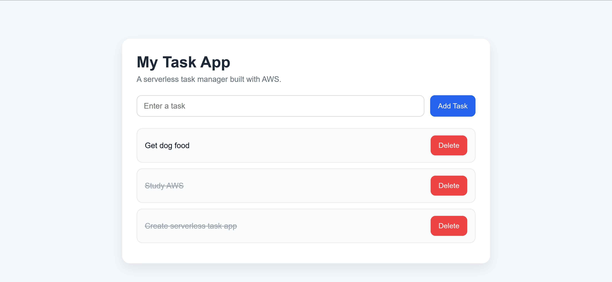

# AWS Serverless Task App

A fully serverless task management web application built using AWS services.

This project demonstrates how to design and deploy a cloud-native application using Amazon API Gateway, AWS Lambda, and Amazon DynamoDB, with a custom frontend built in HTML, CSS, and JavaScript.

## Live Demo

http://ksmith-aws-task-app-2026.s3-website-us-east-1.amazonaws.com

## Features

- Create new tasks
- View all tasks
- Mark tasks as complete/incomplete
- Delete tasks
- Real-time updates via API calls
- Fully serverless architecture

## Architecture

Frontend (HTML/CSS/JavaScript hosted on Amazon S3)  
        ↓  
Amazon API Gateway (REST API)  
        ↓  
AWS Lambda (Business Logic)  
        ↓  
Amazon DynamoDB (Data Storage)

## Screenshots

### Task Dashboard

### Add Task

### Completed Task

## How It Works

1. User enters a task in the frontend  
2. A request is sent to API Gateway  
3. API Gateway triggers a Lambda function  
4. Lambda processes the request and interacts with DynamoDB  
5. DynamoDB stores or updates the task  
6. The frontend refreshes and displays updated data  

## Technologies Used

- Amazon API Gateway
- AWS Lambda
- Amazon DynamoDB
- Amazon S3 (Static Website Hosting)
- HTML
- CSS
- JavaScript

## Project Structure

- `index.html` – application layout  
- `style.css` – UI styling  
- `app.js` – frontend logic and API requests  
- `README.md` – project documentation  

## What I Learned

- Building serverless applications using AWS
- Designing REST APIs with API Gateway
- Writing Lambda functions for backend logic
- Managing data with DynamoDB
- Connecting frontend applications to cloud services
- Debugging API and CORS-related issues

## Future Improvements

- Add user authentication with Amazon Cognito
- Store tasks per user instead of globally
- Improve UI/UX design
- Add due dates and task categories
- Implement loading states and better error handling
